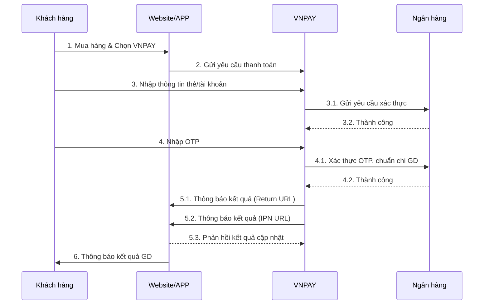
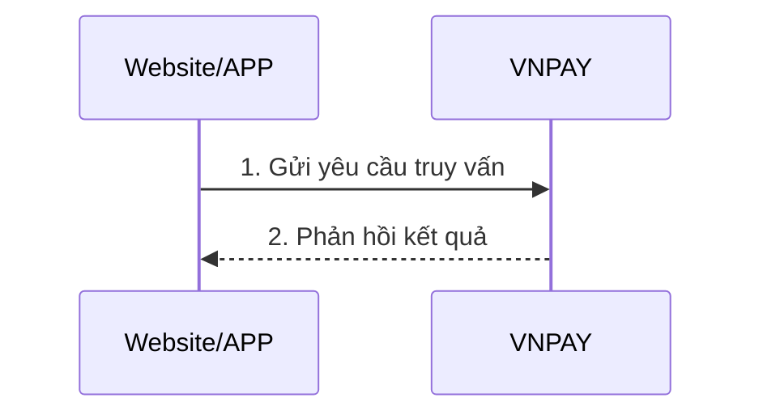
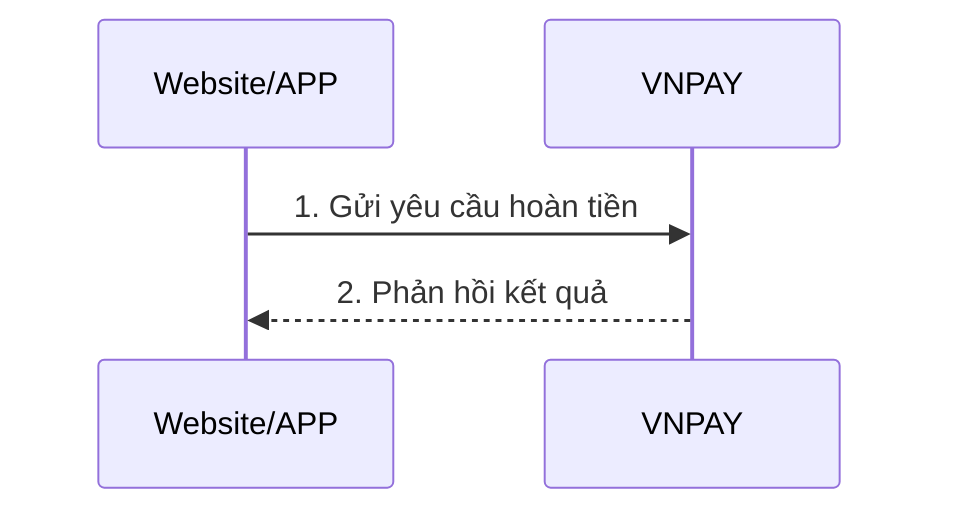

# VNPAY Integration - Veena Travel

## Tổng quan

Hệ thống đã được tích hợp VNPAY để xử lý thanh toán trực tuyến. VNPAY hỗ trợ thanh toán qua thẻ ATM, thẻ quốc tế, ví điện tử và QR code.

## Cấu hình

### 1. Environment Variables

Thêm các biến môi trường sau vào file `.env`:

```env
# VNPAY Configuration
VNPAY_TMN_CODE=your_vnpay_tmn_code
VNPAY_SECRET_KEY=your_vnpay_secret_key
VNPAY_URL=https://sandbox.vnpayment.vn/paymentv2/vpcpay.html
VNPAY_RETURN_URL=http://localhost:5001/api/vnpay/return
VNPAY_IPN_URL=http://localhost:5001/api/vnpay/ipn
```

### 2. Lấy thông tin VNPAY

1. Đăng ký tài khoản tại [VNPAY Sandbox](http://sandbox.vnpayment.vn/devreg/)
2. Lấy `TmnCode` và `SecretKey` từ dashboard
3. Cấu hình Return URL và IPN URL trên VNPAY dashboard

## API Endpoints

### 1. Tạo URL thanh toán VNPAY

**POST** `/api/vnpay/create-payment-url`

```json
{
  "amount": 200000,
  "orderInfo": "Thanh toan tour du lich",
  "orderType": "other",
  "bankCode": "VNBANK",
  "locale": "vn",
  "expireMinutes": 15
}
```

**Response:**
```json
{
  "success": true,
  "message": "VNPAY payment URL created successfully",
  "data": {
    "paymentUrl": "https://sandbox.vnpayment.vn/paymentv2/vpcpay.html?...",
    "txnRef": "VNP123456789",
    "amount": 200000,
    "orderInfo": "Thanh toan tour du lich",
    "createDate": "20240113120000",
    "expireDate": "20240113121500",
    "paymentId": "payment_id"
  }
}
```

### 2. Xử lý Return URL

**GET** `/api/vnpay/return`

VNPAY sẽ chuyển hướng khách hàng về URL này sau khi thanh toán.

### 3. Xử lý IPN URL

**GET** `/api/vnpay/ipn`

VNPAY sẽ gọi URL này để thông báo kết quả thanh toán (server-to-server).

### 4. Truy vấn giao dịch

**POST** `/api/vnpay/query-transaction`

```json
{
  "txnRef": "VNP123456789",
  "transactionDate": "20240113120000"
}
```

### 5. Tạo yêu cầu hoàn tiền

**POST** `/api/vnpay/create-refund`

```json
{
  "txnRef": "VNP123456789",
  "amount": 200000,
  "orderInfo": "Hoan tien giao dich",
  "createBy": "Admin"
}
```

### 6. Lấy danh sách ngân hàng

**GET** `/api/vnpay/banks`

### 7. Lấy thông tin giao dịch

**GET** `/api/vnpay/transaction/:txnRef`

## Luồng thanh toán VNPAY

### 1. Luồng thanh toán chính



### 2. Luồng truy vấn giao dịch



### 3. Luồng hoàn tiền



## Các tham số quan trọng

### Tham số gửi sang VNPAY

| Tham số | Bắt buộc | Mô tả |
|---------|----------|-------|
| vnp_Version | ✓ | Phiên bản API (2.1.0) |
| vnp_Command | ✓ | Mã API (pay) |
| vnp_TmnCode | ✓ | Mã website merchant |
| vnp_Amount | ✓ | Số tiền (nhân 100) |
| vnp_OrderInfo | ✓ | Mô tả đơn hàng |
| vnp_OrderType | ✓ | Loại đơn hàng |
| vnp_TxnRef | ✓ | Mã tham chiếu giao dịch |
| vnp_ReturnUrl | ✓ | URL trả về |
| vnp_IpAddr | ✓ | IP khách hàng |
| vnp_CreateDate | ✓ | Thời gian tạo |
| vnp_ExpireDate | ✓ | Thời gian hết hạn |
| vnp_BankCode | - | Mã ngân hàng |
| vnp_Locale | ✓ | Ngôn ngữ (vn/en) |
| vnp_SecureHash | ✓ | Mã checksum |

### Tham số nhận từ VNPAY

| Tham số | Mô tả |
|---------|-------|
| vnp_ResponseCode | Mã phản hồi (00 = thành công) |
| vnp_TransactionStatus | Trạng thái giao dịch (00 = thành công) |
| vnp_TxnRef | Mã tham chiếu giao dịch |
| vnp_Amount | Số tiền thanh toán |
| vnp_TransactionNo | Mã giao dịch VNPAY |
| vnp_PayDate | Thời gian thanh toán |
| vnp_BankCode | Mã ngân hàng |
| vnp_CardType | Loại thẻ |
| vnp_SecureHash | Mã checksum |

## Mã lỗi VNPAY

### Mã ResponseCode

| Mã | Mô tả |
|----|-------|
| 00 | Giao dịch thành công |
| 07 | Trừ tiền thành công, giao dịch bị nghi ngờ |
| 09 | Thẻ/Tài khoản chưa đăng ký InternetBanking |
| 10 | Xác thực thông tin không đúng quá 3 lần |
| 11 | Đã hết hạn chờ thanh toán |
| 12 | Thẻ/Tài khoản bị khóa |
| 13 | Nhập sai mật khẩu xác thực (OTP) |
| 24 | Khách hàng hủy giao dịch |
| 51 | Tài khoản không đủ số dư |
| 65 | Vượt quá hạn mức giao dịch trong ngày |
| 75 | Ngân hàng đang bảo trì |
| 79 | Nhập sai mật khẩu quá số lần quy định |
| 99 | Các lỗi khác |

### Mã TransactionStatus

| Mã | Mô tả |
|----|-------|
| 00 | Giao dịch thành công |
| 01 | Giao dịch chưa hoàn tất |
| 02 | Giao dịch bị lỗi |
| 04 | Giao dịch đảo |
| 05 | VNPAY đang xử lý hoàn tiền |
| 06 | VNPAY đã gửi yêu cầu hoàn tiền |
| 07 | Giao dịch bị nghi ngờ gian lận |
| 09 | Hoàn trả bị từ chối |

## Bảo mật

### 1. Checksum Verification

Tất cả request/response đều được xác thực bằng checksum HMACSHA512:

```javascript
const signData = querystring.stringify(sortedParams, { encode: false });
const hmac = crypto.createHmac('sha512', secretKey);
const signed = hmac.update(signData, 'utf-8').digest('hex');
```

### 2. IPN URL Security

- IPN URL phải có SSL
- Kiểm tra checksum trước khi xử lý
- Phản hồi đúng RspCode cho VNPAY

### 3. Return URL Security

- Chỉ hiển thị kết quả cho khách hàng
- Không cập nhật database tại Return URL
- Sử dụng IPN URL để cập nhật database

## Testing

### Test tạo thanh toán

```bash
curl -X POST http://localhost:5001/api/vnpay/create-payment-url \
  -H "Content-Type: application/json" \
  -H "Authorization: Bearer YOUR_TOKEN" \
  -d '{
    "amount": 200000,
    "orderInfo": "Test payment",
    "orderType": "other",
    "bankCode": "VNBANK"
  }'
```

### Test truy vấn giao dịch

```bash
curl -X POST http://localhost:5001/api/vnpay/query-transaction \
  -H "Content-Type: application/json" \
  -H "Authorization: Bearer YOUR_TOKEN" \
  -d '{
    "txnRef": "VNP123456789",
    "transactionDate": "20240113120000"
  }'
```

## Lưu ý quan trọng

1. **Số tiền**: Phải nhân 100 để loại bỏ phần thập phân
2. **Checksum**: Luôn kiểm tra checksum trước khi xử lý
3. **IPN URL**: Phải có SSL và phản hồi đúng RspCode
4. **Return URL**: Chỉ hiển thị kết quả, không cập nhật database
5. **TxnRef**: Phải duy nhất trong ngày
6. **Expire Date**: Mặc định 15 phút, có thể tùy chỉnh
7. **Bank Code**: Tùy chọn, nếu không có sẽ cho khách hàng chọn

## Troubleshooting

### Lỗi thường gặp

1. **Invalid checksum**: Kiểm tra secret key và cách tạo checksum
2. **Order not found**: Kiểm tra txnRef có đúng không
3. **Amount mismatch**: Kiểm tra số tiền có nhân 100 chưa
4. **IPN timeout**: Kiểm tra IPN URL có hoạt động không

### Debug

```javascript
// Kiểm tra VNPAY service
console.log(vnpayService.isReady());

// Kiểm tra checksum
const isValid = vnpayService.verifyChecksum(vnpParams);
console.log('Checksum valid:', isValid);
```
